<p align="center">
  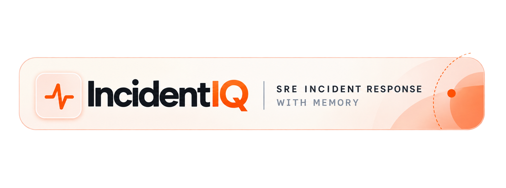
</p>


# IncidentIQ - Intelligent SRE Incident Response

IncidentIQ is an intelligent SRE incident-response agent that uses Hindsight persistent memory to help engineers investigate production incidents, recall previous operational experience, learn from successful and failed resolution attempts, and make safer deployment decisions.

It combines a React frontend, FastAPI backend, Hindsight for persistent operational memory, and Groq-powered AI reasoning to turn past incidents into reusable engineering knowledge.

## Team Code & Chaos

**1. Reddy Gayatri Satya Sai Pravallika**

**2. Mandha Varshitha**

**3. Chenna Keerthana**

**4. Mandadi Vennela**

## Video Presentation

[Watch the IncidentIQ Demo](https://youtu.be/OdgS6RPzdKA?si=XYwCszUG2_4m06cA)

## Problem

When a production incident happens, engineers need more than an analysis of the current logs.

They need to know:

* Has this happened before?
* What caused the previous incident?
* Which fix actually worked?
* Which approaches failed?
* Which runbook was useful?
* What did the team learn from previous incidents?
* Has a previously successful fix become less effective?

## Solution

IncidentIQ turns previous incidents and engineer outcomes into persistent operational memory using Hindsight.

The incident-response workflow works as follows:

1. **Incident Input** — An engineer provides the affected service, severity, alert, logs, and incident context.
2. **Memory Recall** — Hindsight retrieves relevant historical incidents, outcomes, operational observations, and previous fixes.
3. **Evidence Filtering** — The backend filters recalled memories for the relevant service and extracts historical facts and resolution outcomes.
4. **AI Analysis** — Groq analyzes the current incident together with the historical operational evidence.
5. **Recommendations** — IncidentIQ generates ranked recommendations with supporting historical evidence.
6. **Engineer Feedback** — The engineer records whether the recommended action worked, failed, or was only partially effective.
7. **Memory Retention** — The outcome is stored back into Hindsight so future incidents can use the new experience.
8. **Pre-Deploy Analysis** — The same operational memory can be used before a deployment to assess proposed changes and recommend safeguards.

## Screenshots

### Landing Page — IncidentIQ SRE Command Center

<div align="center">

  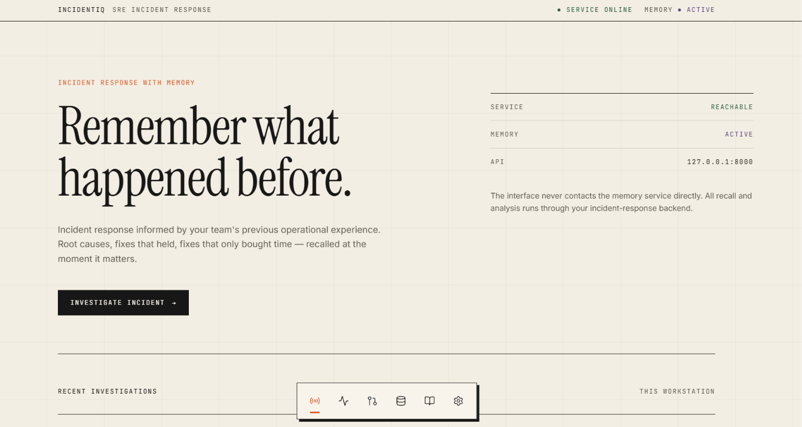

</div>


<div align="center">

  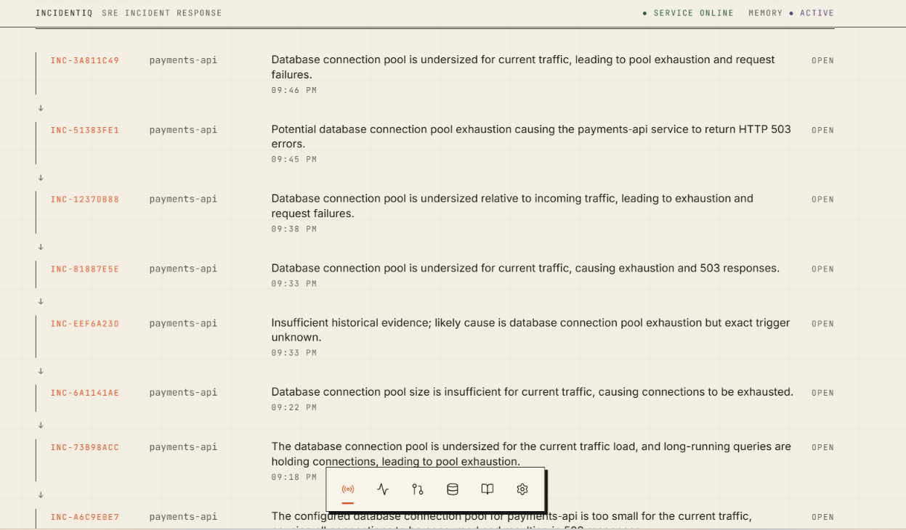

</div>

### Incident Triage — Production Incident Investigation

<div align="center">

  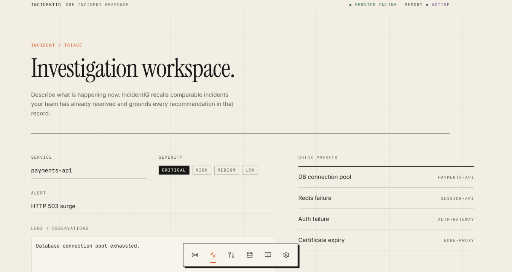

</div>

### Agent Analysis — Root Cause and Evidence-Backed Recommendations

<div align="center">

  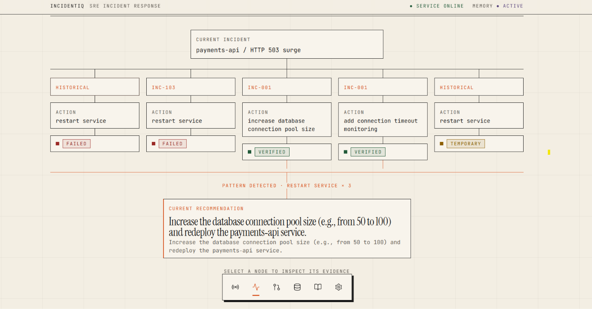

</div>

<div align="center">

  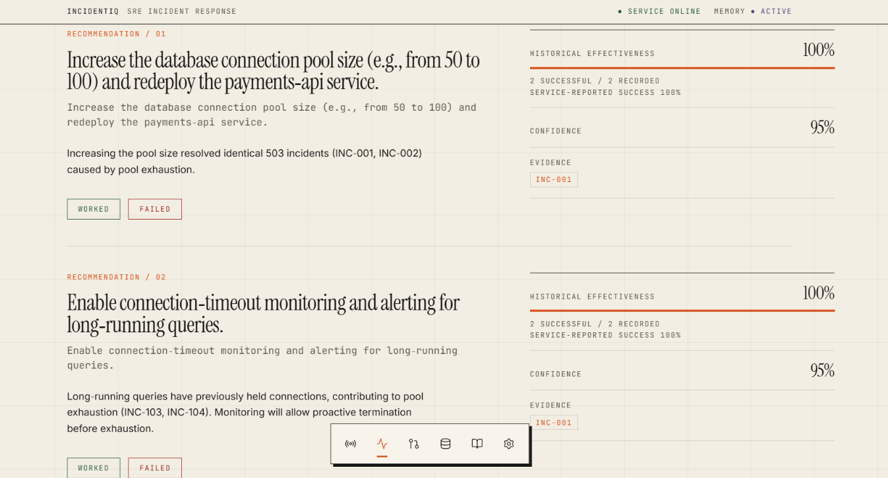

</div>

### Pre-Deploy — Historical Memory-Based Deployment Risk Analysis

<div align="center">

  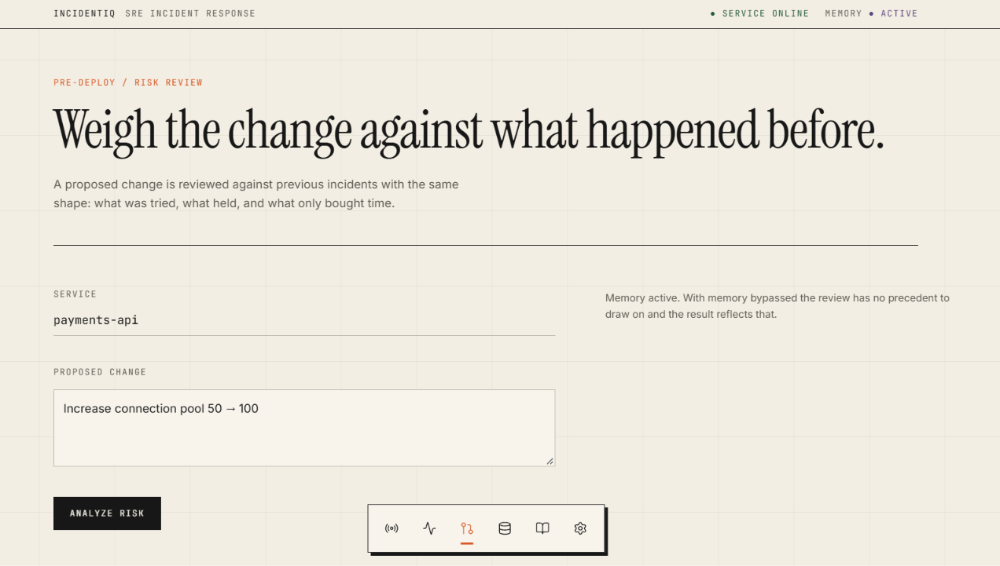

</div>

<div align="center">

  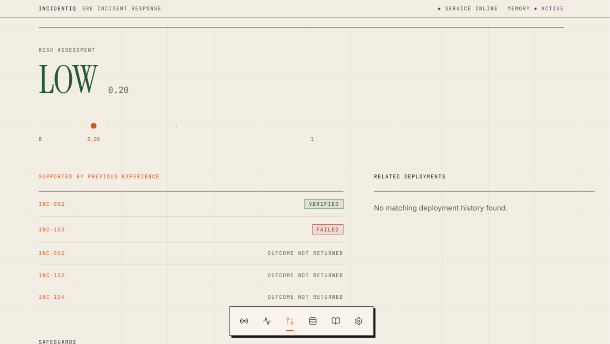

</div>

### Memory Explorer — Persistent Operational Memory

<div align="center">

  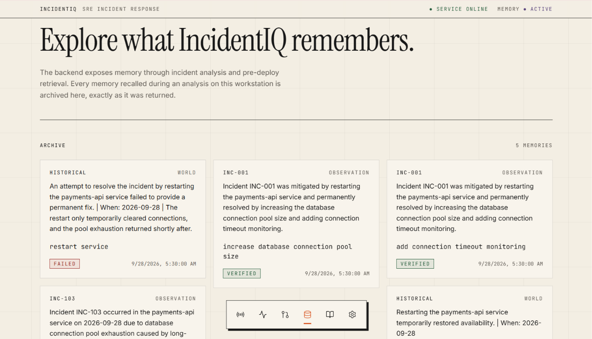

</div>

### Learning Dashboard — Fix Effectiveness and Learning Over Time

<div align="center">

  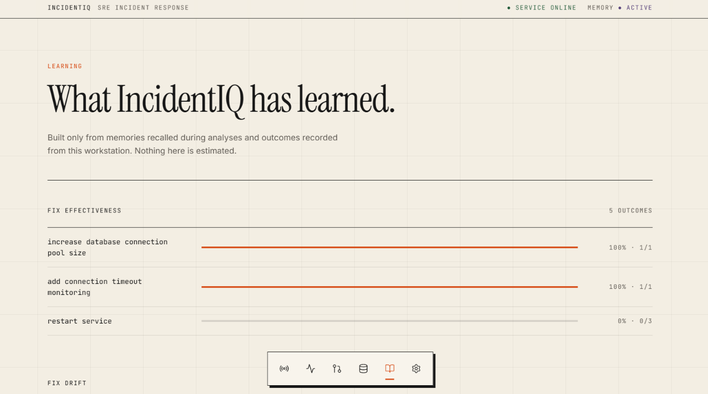

</div>

<div align="center">

  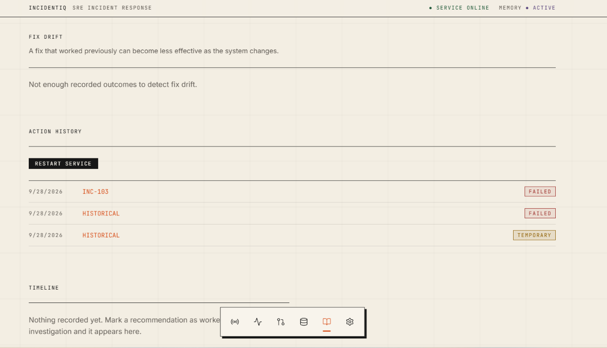

</div>

## Architecture

<div align="center">

  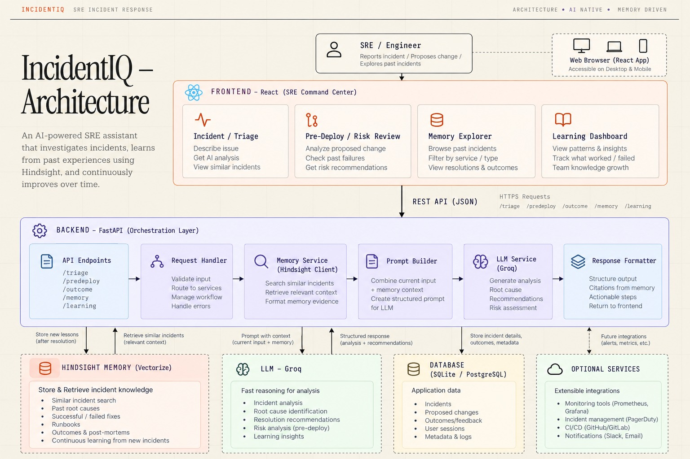

</div>

### Frontend

The React frontend provides the SRE command center:

* Incident investigation
* Agent analysis
* Memory visualization
* Pre-deployment analysis
* Learning dashboard
* Memory ON / OFF comparison

### Backend

The FastAPI backend acts as the orchestration layer:

* Incident triage
* Hindsight memory recall
* Memory filtering
* Historical fact extraction
* Resolution outcome processing
* Groq AI analysis
* Recommendation generation
* Outcome retention
* Pre-deployment analysis

### Hindsight Memory

Hindsight provides persistent operational memory.

It stores and recalls information such as:

* Previous incidents
* Root causes
* Successful fixes
* Failed approaches
* Engineer outcomes
* Operational observations
* Runbook knowledge
* Deployment information
* Post-mortem knowledge

### Groq

Groq provides the reasoning layer for:

* Incident analysis
* Root-cause reasoning
* Recommendation generation
* Historical evidence interpretation
* Pre-deployment risk analysis

Frontend communicates with the backend through REST APIs. API keys for Hindsight and Groq remain on the backend and are never exposed to the frontend.

## Key Features

**Persistent Operational Memory** — Hindsight allows IncidentIQ to recall previous incidents, root causes, fixes, failed approaches, and outcomes instead of treating every incident as a new problem.

**Evidence-Backed Recommendations** — Recommendations are generated using the current incident together with relevant historical operational evidence.

**Successful + Failed Fix Memory** — IncidentIQ remembers both what worked and what failed. A temporary workaround can therefore be distinguished from a permanent resolution.

**Memory ON / OFF Comparison** — Memory can be explicitly enabled or disabled. When memory is disabled, Hindsight is completely bypassed and the model analyzes only the current incident.

**Pre-Deploy Risk Analysis** — Proposed changes can be evaluated against historical incidents and previous operational experience before deployment.

**Memory Explorer** — The operational memories recalled by the system are made visible through the Memory interface.

**Learning Dashboard** — Tracks the effectiveness of fixes and provides a view of how the system's operational knowledge evolves.

**Fix Drift** — Historical fixes can be compared against newer outcomes so that previously successful approaches do not have to be treated as permanently reliable.

**Engineer Feedback Loop** — Engineers can mark recommendations as Worked or Failed, allowing the outcome to become part of future Hindsight memory.

## Hindsight Memory Flow

```text
Incident
   |
   v
Hindsight Recall
   |
   v
Historical Incidents
   +---- Successful Fixes
   |
   +---- Failed Fixes
   |
   +---- Previous Outcomes
   |
   +---- Operational Observations
   |
   v
Groq AI Reasoning
   |
   v
Ranked Recommendation
   |
   v
Engineer Action
   |
   v
Worked / Failed / Partial
   |
   v
Hindsight Retain
   |
   v
Future Incident
```

The central learning loop is:

```text
Incident -> Recall -> Evidence -> Recommendation -> Action -> Outcome -> Retain
```

## Memory ON vs Memory OFF

| Capability                | Memory OFF | Memory ON |
| ------------------------- | :--------: | :-------: |
| Current incident analysis |     Yes    |    Yes    |
| Groq reasoning            |     Yes    |    Yes    |
| Hindsight recall          |     No     |    Yes    |
| Historical incidents      |     No     |    Yes    |
| Previous outcomes         |     No     |    Yes    |
| Historical fixes          |     No     |    Yes    |
| Failed approaches         |     No     |    Yes    |
| Organizational experience |     No     |    Yes    |

When Memory is OFF, Hindsight is not queried.

When Memory is ON, Hindsight becomes part of the reasoning process.

## Incident Example

A payments API experiences a critical HTTP 503 surge.

```text
Service:

payments-api

Severity:

CRITICAL

Symptoms:

- HTTP 503 errors
- Database connection timeouts
- Connection pool exhaustion
- Failed database connections
```

Hindsight recalls previous incidents involving the same service.

```text
INC-001

Problem:

Database connection pool exhaustion

Action:

Increase pool 50 -> 100

Outcome:

WORKED
```

```text
INC-002

Problem:

Database connection timeout

Action:

Increase pool 50 -> 100

Outcome:

WORKED
```

```text
INC-103

Problem:

Connection pool exhaustion

Action:

Restart service

Outcome:

Temporary relief / not a permanent fix
```

IncidentIQ can therefore provide recommendations such as:

```text
#1 Increase the payments-api connection pool from 50 to 100

Historical evidence:

Previous incidents were resolved by increasing the pool.

#2 Add connection-pool monitoring

Historical evidence:

Monitoring helped detect connection exhaustion earlier.

#3 Restart the payments-api service

Historical evidence:

Restarting provided temporary relief but did not permanently
resolve the underlying connection-pool problem.
```

This demonstrates that the agent can remember both successful and unsuccessful operational approaches.

## Pre-Deploy Risk Analysis

IncidentIQ also uses the same operational memory before a change reaches production.

Example:

```text
Service:

payments-api

Proposed Change:

Increase database connection pool from 50 -> 100
```

The backend recalls relevant historical incidents and sends the historical evidence together with the proposed change to the AI reasoning layer.

The result contains:

* Risk level
* Risk score
* Historical rationale
* Related incidents
* Related deployments
* Recommended safeguards
* Rollback considerations

Example:

```text
Risk:

LOW

Risk Score:

0.20
```

The system can recommend safeguards such as:

```text
- Monitor database connection count
- Monitor database latency
- Watch for connection saturation
- Verify database maximum connection capacity
- Maintain a rollback path
```

## Learning & Fix Drift

IncidentIQ is designed to learn from outcomes rather than simply retrieve old information.

```text
Incident 1
    |
    v
Fix
    |
    v
Worked
    |
    v
Hindsight

Incident 2
    |
    v
Similar Problem
    |
    v
Hindsight Recall
    |
    v
Previous Successful Fix
    |
    v
Recommendation

New Outcome
    |
    v
Hindsight Retain
```

If a previously successful fix begins failing in newer incidents, the system can surface this change as potential fix drift.

This helps prevent the agent from blindly repeating an old solution when the underlying system has changed.

## Tech Stack

| Layer             | Technology                      |
| ----------------- | ------------------------------- |
| Frontend          | React, TypeScript, Tailwind CSS |
| Backend           | Python, FastAPI, Pydantic       |
| Memory            | Hindsight                       |
| LLM               | Groq — `openai/gpt-oss-120b`    |
| API Communication | REST API                        |
| Development       | Git, GitHub                     |

## Getting Started

### Prerequisites

* Python 3.x
* Node.js
* npm
* Hindsight API access
* Groq API key

### Quick Start

```bash
# 1. Clone the repository
git clone https://github.com/Pravallika2789/IncidentIQ-SRE-Agent.git

cd IncidentIQ-SRE-Agent

# 2. Backend
cd Backend

# 3. Install dependencies
pip install -r requirements.txt

# 4. Start backend
uvicorn app.main:app --reload --port 8000
```

Open another terminal:

```bash
# 5. Frontend
cd Frontend

# 6. Install dependencies
npm install

# 7. Start frontend
npm run dev
```

Open the local URL provided by the frontend development server.

## Configuration

Settings are read from `Backend/.env`:

| Variable             | Default                              | Description                      |
| -------------------- | ------------------------------------ | -------------------------------- |
| `HINDSIGHT_API_KEY`  | `(required)`                         | Hindsight API key                |
| `HINDSIGHT_BASE_URL` | `https://api.hindsight.vectorize.io` | Hindsight API endpoint           |
| `HINDSIGHT_BANK_ID`  | `incidentiq-sre`                     | IncidentIQ Hindsight memory bank |
| `GROQ_API_KEY`       | `(required)`                         | Groq API key                     |

Create a local `.env` file:

```env
HINDSIGHT_API_KEY=your_hindsight_api_key
HINDSIGHT_BASE_URL=https://api.hindsight.vectorize.io
HINDSIGHT_BANK_ID=incidentiq-sre
GROQ_API_KEY=your_groq_api_key
```

API keys are kept on the backend and should never be committed to GitHub.

## API

| Method | Path             | Description                   |
| ------ | ---------------- | ----------------------------- |
| POST   | `/api/triage`    | Analyze a production incident |
| POST   | `/api/outcome`   | Record an engineer's outcome  |
| POST   | `/api/predeploy` | Assess deployment risk        |

### `/api/triage`

Analyzes an incident using current incident information and, when enabled, relevant Hindsight memories.

Example request:

```json
{
  "service": "payments-api",
  "severity": "CRITICAL",
  "alert": "HTTP 503 error rate > 20%",
  "logs": "Database connection timeout and connection pool exhaustion",
  "memory_enabled": true
}
```

### `/api/outcome`

Records the actual result of an engineer's action.

Example:

```json
{
  "incident_id": "INC-001",
  "service": "payments-api",
  "action": "Increase connection pool from 50 to 100",
  "outcome": "WORKED",
  "notes": "Connection errors returned to normal."
}
```

The outcome is retained in Hindsight for future incidents.

### `/api/predeploy`

Evaluates a proposed deployment using historical operational memory.

Example:

```json
{
  "service": "payments-api",
  "change": "Increase connection pool from 50 to 100",
  "memory_enabled": true
}
```

## Project Structure

```text
IncidentIQ-SRE-Agent/
|
├── Backend/
│   ├── app/
│   │   ├── __init__.py
│   │   ├── main.py
│   │   ├── hindsight_service.py
│   │   ├── groq_service.py
│   │   ├── incident_analysis.py
│   │   └── models.py
│   │
│   ├── requirements.txt
│   └── README.md
│
├── Frontend/
│   ├── src/
│   ├── public/
│   └── package.json
│
├── Docs/
│   ├── Architecture.png
│   ├── 6185807110717772146.jpg
│   └── Screenshots/
│       ├── incident-analysis.png
│       ├── landing-page.png
│       ├── landing-page1.png
│       ├── memory-explorer.png
│       ├── incident-triage.png
│       ├── learning-dashboard.png
│       ├── predeploy-risk.png
│       └── incidentiq-symbol.png
│
├── .env.example
├── .gitignore
└── README.md
```
